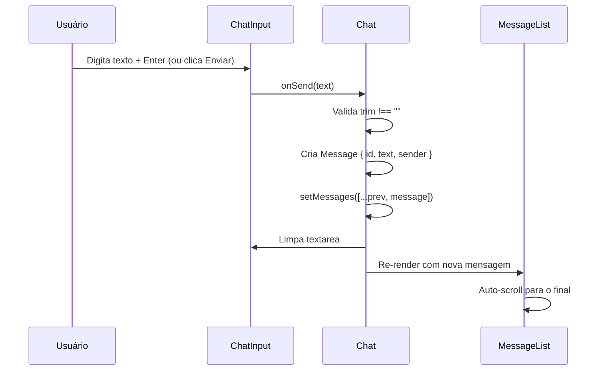

# PRD — Chat Offline

## 1. Visão geral

Aplicação de chat em janela única onde o usuário envia mensagens alternando entre dois remetentes: **usuário** (alinhado à direita) e **robô** (alinhado à esquerda). O histórico vive apenas em memória (React state), sem persistência.

**Stack:** Vite + React + TypeScript + Tailwind CSS (já configurados).

---

## 2. Objetivos

| Objetivo | Critério de sucesso |
|---|---|
| Enviar mensagens como usuário ou robô | Toggle no input altera o remetente da próxima mensagem |
| Histórico em memória | Mensagens somem ao recarregar a página |
| Layout responsivo e centralizado | `max-w-2xl` centralizado em telas maiores |
| Input fixo no rodapé | Card de input permanece no canto inferior durante o scroll |

## 3. Fora de escopo

- Persistência (localStorage, backend, etc.)
- Autenticação
- Edição ou exclusão de mensagens
- Horários, rótulos de remetente ou cabeçalho do chat
- Markdown, anexos ou formatação rica (apenas texto plano)

---

## 4. Convenções técnicas

| Regra | Detalhe |
|---|---|
| Tipos | `type` (não `interface`) em `src/types/` |
| Componentes | `src/components/` |
| Estado | `useState` no componente raiz do chat (ou hook dedicado) |
| Estilização | Tailwind CSS exclusivamente |
| Lint | `oxlint` (já configurado no projeto) |

---

## 5. Modelo de dados

```ts
// src/types/message.ts
type Sender = 'user' | 'robot'

type Message = {
  id: string
  text: string
  sender: Sender
}
```

- `id`: identificador único gerado no envio (ex.: `crypto.randomUUID()`)
- `text`: conteúdo em texto plano, sem trim obrigatório na exibição (trim apenas para validar envio vazio)
- `sender`: determina o alinhamento no histórico

---

## 6. Requisitos funcionais

### RF-01 — Histórico de mensagens

- Lista ordenada cronologicamente (mais antiga no topo, mais recente embaixo).
- Mensagens do **usuário** alinhadas à **direita**.
- Mensagens do **robô** alinhadas à **esquerda**.
- Bolhas com fundo neutro (cinza/branco), sem cor distinta por remetente.
- Scroll automático para a última mensagem ao enviar.

### RF-02 — Estado vazio

- Quando não houver mensagens, exibir texto indicativo (ex.: *"Nenhuma mensagem ainda. Envie a primeira!"*).
- O estado vazio ocupa a área de histórico acima do input.

### RF-03 — Input de mensagem

- Campo de texto multilinha (`textarea`) com altura ajustada conforme o conteúdo.
- Card branco fixo no canto inferior da área do chat.
- **Enter** envia a mensagem.
- **Shift + Enter** insere quebra de linha.
- Após envio: limpar o campo e resetar a altura do textarea.

### RF-04 — Botão de enviar

- Posicionado à **direita** dentro do card de input.
- **Desabilitado** quando o campo estiver vazio (após `trim`).
- Habilitado quando houver texto.

### RF-05 — Toggle usuário / robô

- Posicionado à **esquerda** dentro do card de input.
- Apresentação: **ícone + texto** indicando o remetente ativo.
- Estado padrão ao abrir: **usuário**.
- Ao alternar para **robô**: borda roxa no card de input (`border-purple-*`).
- Ao voltar para **usuário**: borda padrão (sem destaque roxo).
- O toggle afeta apenas a **próxima** mensagem a ser enviada; mensagens já enviadas não mudam.

---

## 7. Requisitos visuais

### Layout geral

```
┌─────────────────────────────────────────────┐
│  fundo marrom claro (tela inteira)          │
│                                             │
│     ┌─────────────────────────────┐         │
│     │  max-w-2xl, centralizado    │         │
│     │                             │         │
│     │  [estado vazio / histórico] │         │
│     │                             │         │
│     │  ┌───────────────────────┐  │         │
│     │  │ [toggle] [textarea] [▶]│  │ ← fixo │
│     │  └───────────────────────┘  │         │
│     └─────────────────────────────┘         │
└─────────────────────────────────────────────┘
```

| Elemento | Especificação |
|---|---|
| Fundo da página | Marrom claro (ex.: `bg-stone-200` ou `bg-amber-100`) |
| Container do chat | `max-w-2xl`, `mx-auto`, altura total da viewport |
| Card do input | Fundo branco, `rounded`, sombra sutil opcional |
| Borda modo robô | Roxa (ex.: `border-2 border-purple-500`) |
| Bolhas de mensagem | Fundo neutro (ex.: `bg-white` ou `bg-gray-100`), `rounded-lg`, padding interno |
| Área de histórico | `flex-1`, `overflow-y-auto`, padding inferior suficiente para não ficar atrás do input fixo |

### Comportamento do textarea

- Altura mínima de uma linha.
- Cresce conforme o conteúdo até um máximo razoável (ex.: ~6 linhas), depois scroll interno.
- Implementação sugerida: ajuste via `scrollHeight` em `onInput` ou hook `useAutoResizeTextarea`.

---

## 8. Arquitetura de componentes

```
src/
├── types/
│   └── message.ts          # Sender, Message
├── components/
│   ├── Chat.tsx            # Orquestra estado e layout
│   ├── MessageList.tsx     # Lista + estado vazio + auto-scroll
│   ├── MessageBubble.tsx   # Bolha individual
│   ├── ChatInput.tsx       # Card fixo: toggle + textarea + botão enviar
│   └── SenderToggle.tsx    # Botão ícone + texto usuário/robô
├── App.tsx                 # Renderiza <Chat />
└── index.css               # Tailwind import (já existente)
```

### Responsabilidades

| Componente | Responsabilidade |
|---|---|
| `Chat` | State `messages[]`, state `sender` (toggle), handler `handleSend` |
| `MessageList` | Renderiza lista ou empty state; `useEffect` + ref para auto-scroll |
| `MessageBubble` | Recebe `Message`, aplica alinhamento esquerda/direita |
| `ChatInput` | Layout do card fixo, repassa props para filhos |
| `SenderToggle` | Alterna entre `'user'` e `'robot'`, exibe ícone + label |

---

## 9. Fluxo de envio



---

## 10. Tarefas de implementação (ordem progressiva)

Cada tarefa deve resultar em algo funcional ou visualmente verificável antes de avançar para a próxima.

### Fase 1 — Fundação

#### Tarefa 1.1 — Tipos e estrutura de pastas
- [ ] Criar `src/types/message.ts` com `Sender` e `Message`
- [ ] Criar pastas `src/components/` (se ainda não existir)
- **Verificação:** projeto compila sem erros (`npm run build`)

#### Tarefa 1.2 — Layout base da página
- [ ] Criar `Chat.tsx` com estrutura mínima
- [ ] Aplicar fundo marrom claro na página inteira
- [ ] Container `max-w-2xl mx-auto` com altura `min-h-screen` (ou `h-dvh`)
- [ ] Conectar `<Chat />` em `App.tsx`
- **Verificação:** tela com fundo marrom e container centralizado visível

---

### Fase 2 — Histórico de mensagens

#### Tarefa 2.1 — Estado e componente de bolha
- [x] State `messages: Message[]` em `Chat.tsx` (inicialmente vazio ou com dados mock para desenvolvimento)
- [x] Criar `MessageBubble.tsx`: recebe `message`, alinha à direita (`user`) ou esquerda (`robot`), bolha neutra
- **Verificação:** bolhas mockadas renderizam com alinhamento correto

#### Tarefa 2.2 — Lista de mensagens
- [x] Criar `MessageList.tsx`: mapeia `messages` em `MessageBubble`
- [x] Área com `flex-1 overflow-y-auto` ocupando espaço acima do input
- [ ] Remover mocks; usar state real
- **Verificação:** lista renderiza mensagens do state em ordem cronológica

#### Tarefa 2.3 — Estado vazio
- [x] Em `MessageList.tsx`, quando `messages.length === 0`, exibir texto de empty state
- **Verificação:** mensagem de estado vazio aparece ao iniciar o app

#### Tarefa 2.4 — Auto-scroll
- [x] Ref no final da lista; `useEffect` rola para o final quando `messages` muda
- **Verificação:** ao adicionar mensagem (via mock temporário ou input), scroll vai para a última

---

### Fase 3 — Input e envio

#### Tarefa 3.1 — Card de input fixo
- [x] Criar `ChatInput.tsx` com card branco fixo no rodapé do container do chat
- [x] Layout flex: `[espaço toggle] [textarea flex-1] [botão enviar]`
- [x] Garantir padding inferior no `MessageList` para o conteúdo não ficar oculto atrás do card
- **Verificação:** card branco fixo no canto inferior, histórico scrollável acima

#### Tarefa 3.2 — Textarea com auto-resize
- [x] Textarea multilinha que cresce com o conteúdo (mín. 1 linha, máx. ~6 linhas)
- [x] Placeholder opcional (ex.: "Digite uma mensagem...")
- **Verificação:** textarea expande e contrai conforme o texto

#### Tarefa 3.3 — Botão de enviar
- [x] Botão à direita do card
- [x] Desabilitado quando `text.trim() === ''`
- [x] Ícone ou label "Enviar"
- **Verificação:** botão só habilita com texto; clique dispara callback `onSend`

#### Tarefa 3.4 — Lógica de envio
- [x] `handleSend` em `Chat.tsx`: valida trim, cria `Message`, adiciona ao state, limpa input
- [x] Conectar `ChatInput` ao `handleSend`
- [x] **Enter** envia; **Shift+Enter** quebra linha (`onKeyDown` no textarea)
- **Verificação:** mensagens aparecem no histórico com alinhamento de usuário (padrão)

---

### Fase 4 — Toggle usuário / robô

#### Tarefa 4.1 — Componente SenderToggle
- [ ] Criar `SenderToggle.tsx` com botão ícone + texto
- [ ] Estados visuais distintos para `user` e `robot` (ícone e label diferentes)
- [ ] Callback `onToggle` alterna o remetente
- **Verificação:** clique alterna visualmente entre usuário e robô

#### Tarefa 4.2 — Integrar toggle ao fluxo de envio
- [ ] State `sender: Sender` em `Chat.tsx` (padrão: `'user'`)
- [ ] `handleSend` usa `sender` ao criar a `Message`
- [ ] Posicionar `SenderToggle` à esquerda do card em `ChatInput`
- **Verificação:** mensagens enviadas com toggle em robô aparecem à esquerda

#### Tarefa 4.3 — Borda roxa no modo robô
- [ ] Quando `sender === 'robot'`, aplicar `border-purple-*` no card de input
- [ ] Quando `sender === 'user'`, borda padrão (cinza ou transparente)
- **Verificação:** borda roxa visível apenas com toggle em robô

---

### Fase 5 — Polimento

#### Tarefa 5.1 — Ajustes visuais finais
- [ ] Espaçamento consistente entre bolhas (`gap-2` ou `space-y-2`)
- [ ] Padding interno nas bolhas e no card de input
- [ ] Transição suave na borda do card ao alternar toggle (opcional: `transition-colors`)
- [ ] Revisar contraste e legibilidade no fundo marrom
- **Verificação:** UI coesa e alinhada com as especificações visuais

#### Tarefa 5.2 — Revisão de qualidade
- [ ] Rodar `npm run lint` e corrigir issues
- [ ] Rodar `npm run build` sem erros
- [ ] Teste manual do fluxo completo:
  - Estado vazio → enviar como usuário → enviar como robô → alternar toggle → scroll automático
- **Verificação:** build e lint limpos; fluxo manual OK

---

## 11. Referência rápida de decisões

| Decisão | Escolha |
|---|---|
| Toggle padrão | Usuário |
| Toggle UI | Botão com ícone + texto |
| Estilo das bolhas | Neutras (cinza/branco), sem cor por remetente |
| Teclado | Enter envia; Shift+Enter quebra linha |
| Extras | Auto-scroll + estado vazio |
| Persistência | Nenhuma |
| Formato das mensagens | Texto plano |

---

## 12. Critérios de aceite (checklist final)

- [ ] Fundo marrom claro em tela cheia
- [ ] Chat centralizado com `max-w-2xl`
- [ ] Mensagens de usuário à direita, robô à esquerda
- [ ] Bolhas com fundo neutro
- [ ] Estado vazio quando sem mensagens
- [ ] Auto-scroll ao enviar
- [ ] Input em card branco fixo no rodapé
- [ ] Textarea com altura dinâmica
- [ ] Botão enviar desabilitado sem texto
- [ ] Enter envia, Shift+Enter quebra linha
- [ ] Toggle ícone + texto; padrão usuário
- [ ] Borda roxa no card quando modo robô
- [ ] Histórico perdido ao recarregar a página
- [ ] Tipos em `src/types/`, componentes em `src/components/`
- [ ] Build e lint sem erros
